# Sistem Informasi Manajemen Praktikum (SIMPRAK)

**Nama Mahasiswa:** [Nashrul Fikri]
**NIM:** [20230140105]
**Mata Kuliah:** Praktikum Pengembangan Desain Web

## Deskripsi Proyek
Aplikasi web ini adalah Sistem Informasi Manajemen Praktikum (SIMPRAK) yang dirancang untuk mengelola kegiatan praktikum di institusi pendidikan. Aplikasi ini melayani dua jenis pengguna: Mahasiswa dan Asisten (Admin). Dibangun menggunakan PHP Native, MySQL/MariaDB, dan Tailwind CSS untuk antarmuka.

## Fungsionalitas
Aplikasi ini mengimplementasikan semua fungsionalitas wajib sesuai Use Case Diagram dan spesifikasi yang diberikan, meliputi:

### Fitur Umum & Autentikasi
* Registrasi Akun
* Login & Logout
* Pengelolaan Sesi Berbasis Peran (Role-based access)

### Fungsionalitas Mahasiswa
1.  **Mencari Mata Praktikum:** Melihat katalog mata praktikum yang tersedia.
2.  **Mendaftar ke Praktikum:** Mendaftar ke mata praktikum tertentu.
3.  **Melihat Praktikum yang Diikuti:** Melihat daftar praktikum yang sudah diikuti.
4.  **Melihat Detail & Tugas Praktikum:**
    * Mengunduh materi modul.
    * Mengumpulkan dan memperbarui laporan.
    * Melihat nilai dan feedback laporan.

### Fungsionalitas Asisten (Admin)
1.  **Mengelola Mata Praktikum:** CRUD (Create, Read, Update, Delete) data mata praktikum.
2.  **Mengelola Modul:** Menambah, mengubah, menghapus modul per mata praktikum, termasuk fitur upload file materi.
3.  **Melihat Laporan Masuk:** Melihat daftar semua laporan yang dikumpulkan mahasiswa, dengan fitur filter.
4.  **Memberi Nilai Laporan:** Mengunduh laporan, memberi nilai, dan feedback.
5.  **Mengelola Akun Pengguna:** CRUD akun mahasiswa dan asisten lainnya.

## Tampilan Antarmuka (UI Screenshots)

---

### 1. Halaman Registrasi
*Deskripsi singkat halaman ini.*
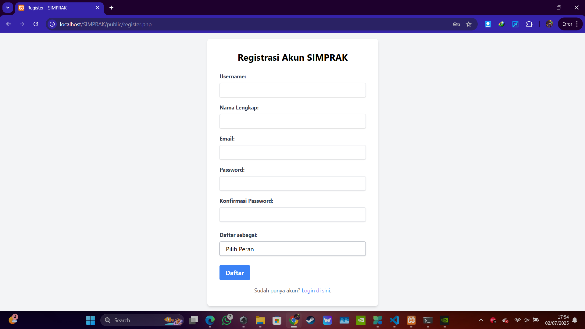

### 2. Halaman Login
*Deskripsi singkat halaman ini.*
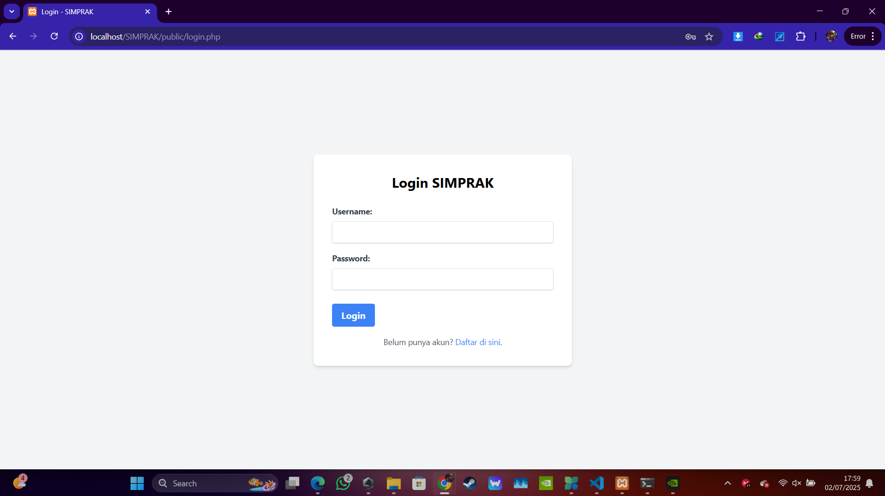

### 3. Dashboard Mahasiswa
*Deskripsi singkat halaman ini.*
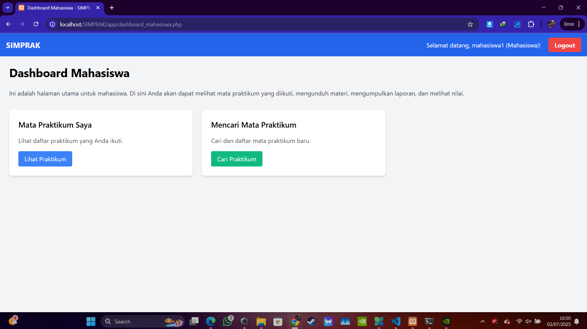

### 4. Katalog Mata Praktikum (Mahasiswa/Publik)
*Deskripsi singkat halaman ini.*
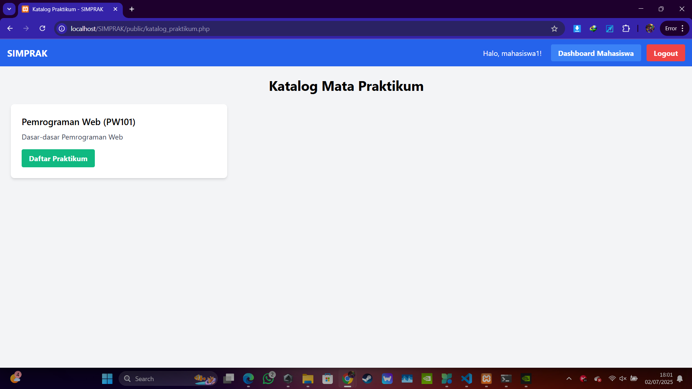

### 5. Praktikum Saya (Mahasiswa)
*Deskripsi singkat halaman ini.*
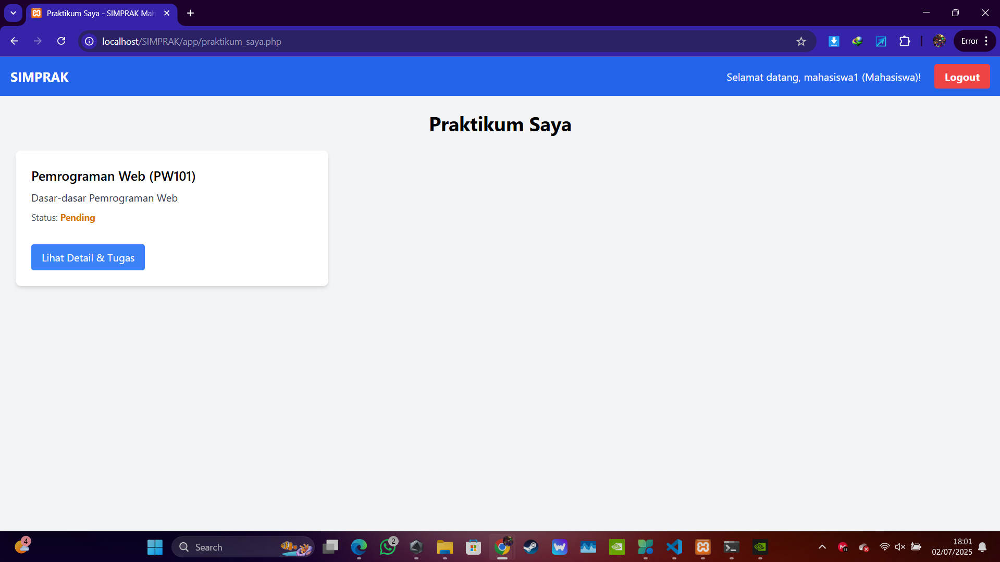

### 6. Detail Praktikum & Tugas (Mahasiswa)
*Deskripsi singkat halaman ini.*
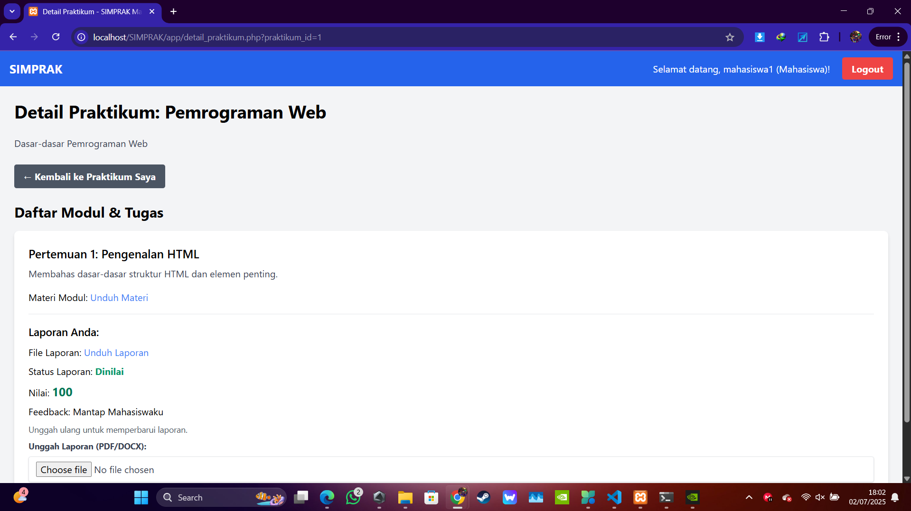

### 7. Dashboard Asisten
*Deskripsi singkat halaman ini.*
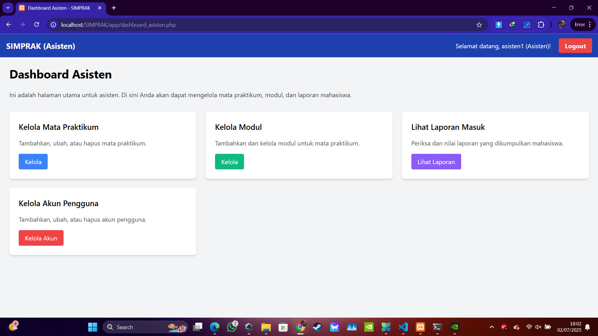

### 8. Kelola Mata Praktikum (Asisten)
*Deskripsi singkat halaman ini.*
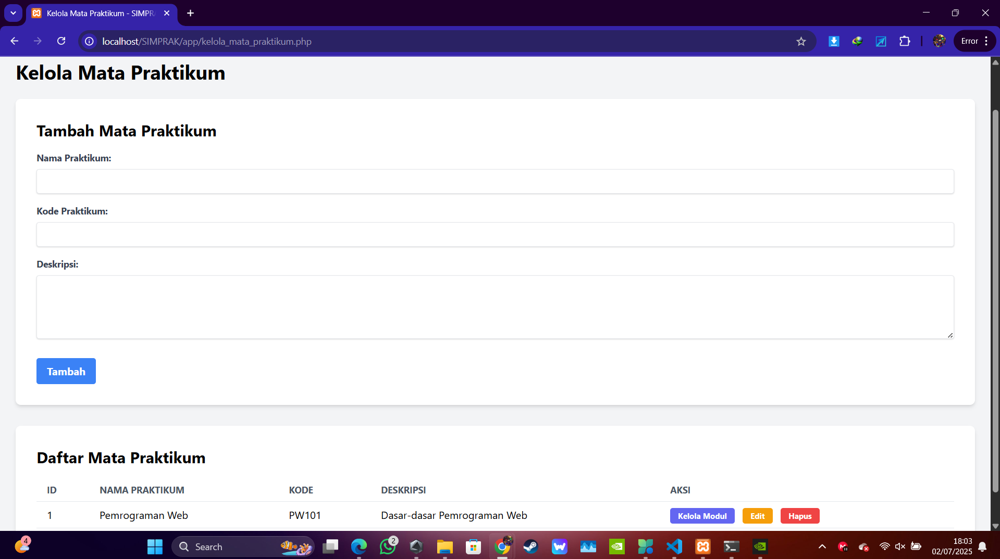

### 9. Kelola Modul (Asisten)
*Deskripsi singkat halaman ini.*
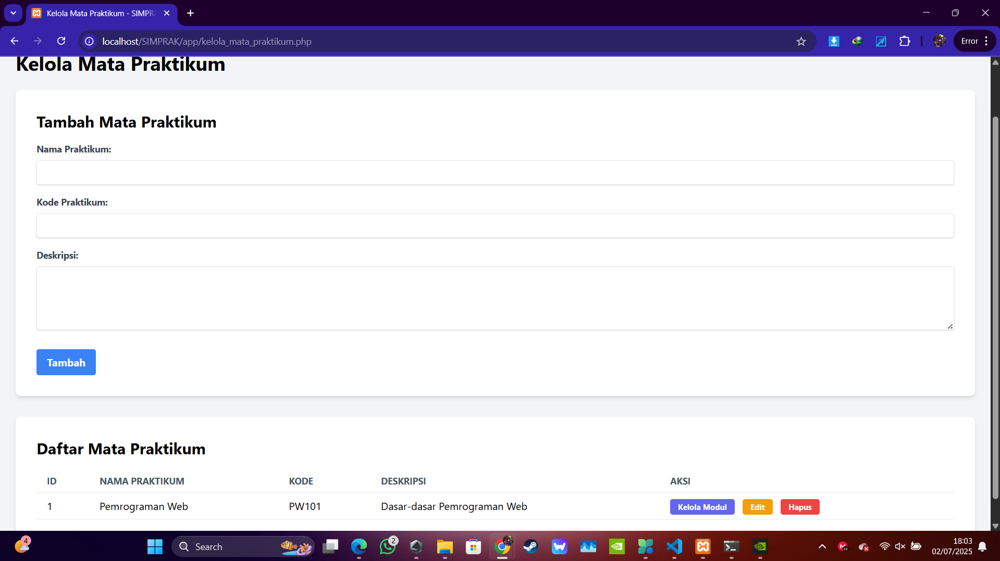

### 10. Laporan Masuk (Asisten)
*Deskripsi singkat halaman ini.*
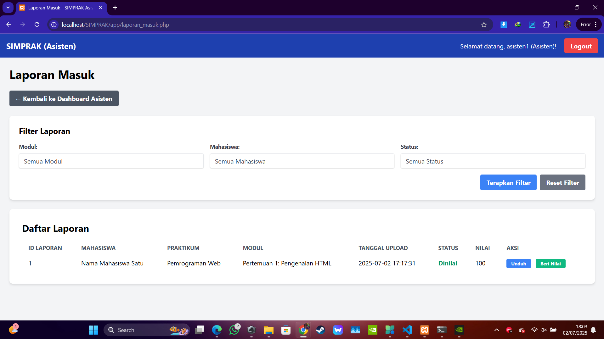

### 11. Beri Nilai Laporan (Asisten)
*Deskripsi singkat halaman ini.*
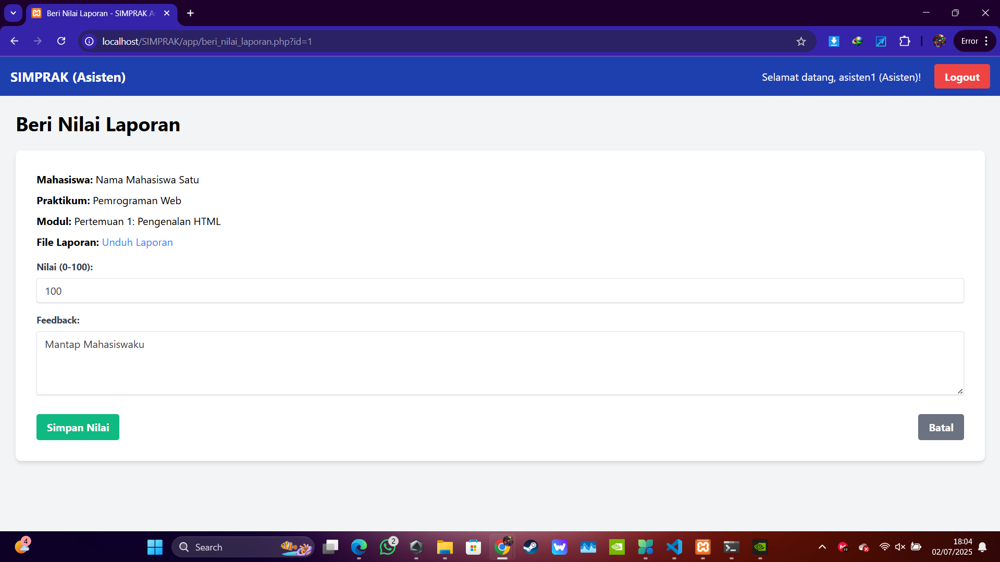

### 12. Kelola Akun Pengguna (Asisten)
*Deskripsi singkat halaman ini.*
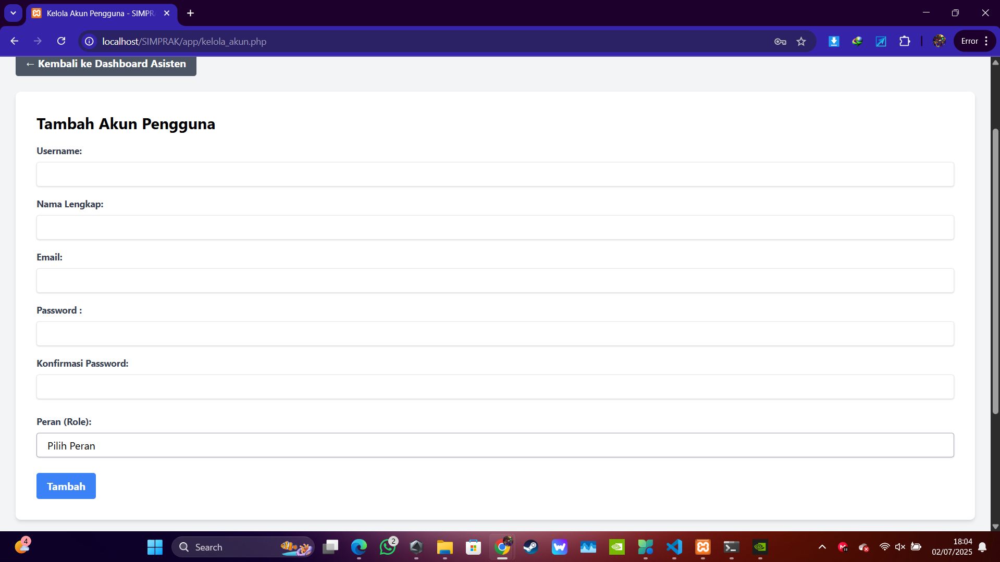

---

## Cara Menjalankan Proyek
1.  Pastikan Anda memiliki XAMPP (atau Apache dan MySQL/MariaDB terpisah) terinstal dan berjalan.
2.  Clone repositori ini ke dalam folder `htdocs` XAMPP Anda. Ganti `NIM` dengan NIM Anda:
    ```bash
    git clone [https://github.com/YOUR_USERNAME/NIM_UAS_PDW.git](https://github.com/YOUR_USERNAME/NIM_UAS_PDW.git) simrak_pdw
    ```
3.  Akses phpMyAdmin (`http://localhost/phpmyadmin/`).
4.  Buat database baru bernama `simbrak_db`.
5.  Impor file SQL skema database (jika ada, atau buat tabel secara manual seperti yang sudah kita lakukan).
    * Untuk membuat tabel, jalankan SQL berikut satu per satu di tab SQL phpMyAdmin:
        * Tabel `users`:
            ```sql
            CREATE TABLE users ( id INT AUTO_INCREMENT PRIMARY KEY, username VARCHAR(50) NOT NULL UNIQUE, password VARCHAR(255) NOT NULL, role ENUM('mahasiswa', 'asisten') NOT NULL, nama VARCHAR(100) NOT NULL, email VARCHAR(100) UNIQUE, created_at TIMESTAMP DEFAULT CURRENT_TIMESTAMP );
            ```
        * Tabel `mata_praktikum`:
            ```sql
            CREATE TABLE mata_praktikum ( id INT AUTO_INCREMENT PRIMARY KEY, nama_praktikum VARCHAR(255) NOT NULL UNIQUE, deskripsi TEXT, kode_praktikum VARCHAR(50) UNIQUE, created_at TIMESTAMP DEFAULT CURRENT_TIMESTAMP );
            ```
        * Tabel `modul_praktikum`:
            ```sql
            CREATE TABLE modul_praktikum ( id INT AUTO_INCREMENT PRIMARY KEY, mata_praktikum_id INT NOT NULL, judul_modul VARCHAR(255) NOT NULL, deskripsi_modul TEXT, nama_file_materi VARCHAR(255), tipe_file_materi VARCHAR(100), ukuran_file_materi INT, created_at TIMESTAMP DEFAULT CURRENT_TIMESTAMP, FOREIGN KEY (mata_praktikum_id) REFERENCES mata_praktikum(id) ON DELETE CASCADE );
            ```
        * Tabel `pendaftaran_praktikum`:
            ```sql
            CREATE TABLE pendaftaran_praktikum ( id INT AUTO_INCREMENT PRIMARY KEY, user_id INT NOT NULL, mata_praktikum_id INT NOT NULL, status_pendaftaran ENUM('pending', 'approved', 'rejected') DEFAULT 'pending', tanggal_daftar TIMESTAMP DEFAULT CURRENT_TIMESTAMP, FOREIGN KEY (user_id) REFERENCES users(id) ON DELETE CASCADE, FOREIGN KEY (mata_praktikum_id) REFERENCES mata_praktikum(id) ON DELETE CASCADE, UNIQUE (user_id, mata_praktikum_id) );
            ```
        * Tabel `laporan_praktikum`:
            ```sql
            CREATE TABLE laporan_praktikum ( id INT AUTO_INCREMENT PRIMARY KEY, pendaftaran_id INT NOT NULL, modul_id INT NOT NULL, nama_file_laporan VARCHAR(255) NOT NULL, tipe_file_laporan VARCHAR(100), ukuran_file_laporan INT, tanggal_upload TIMESTAMP DEFAULT CURRENT_TIMESTAMP, nilai INT, feedback TEXT, status ENUM('pending', 'dinilai') DEFAULT 'pending', FOREIGN KEY (pendaftaran_id) REFERENCES pendaftaran_praktikum(id) ON DELETE CASCADE, FOREIGN KEY (modul_id) REFERENCES modul_praktikum(id) ON DELETE CASCADE, UNIQUE (pendaftaran_id, modul_id) );
            ```
6.  Pastikan folder `public/materi_modul` dan `public/laporan_praktikum` ada dan memiliki izin tulis.
7.  Akses aplikasi melalui browser: `http://localhost/simrak_pdw/` (atau nama folder tempat Anda mengkloning).